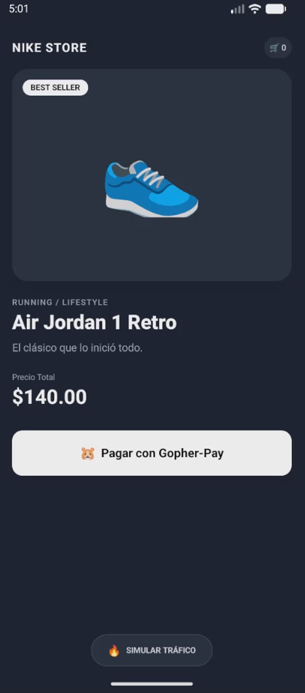
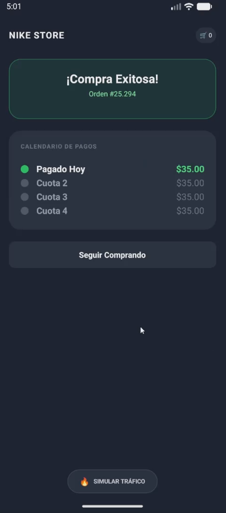
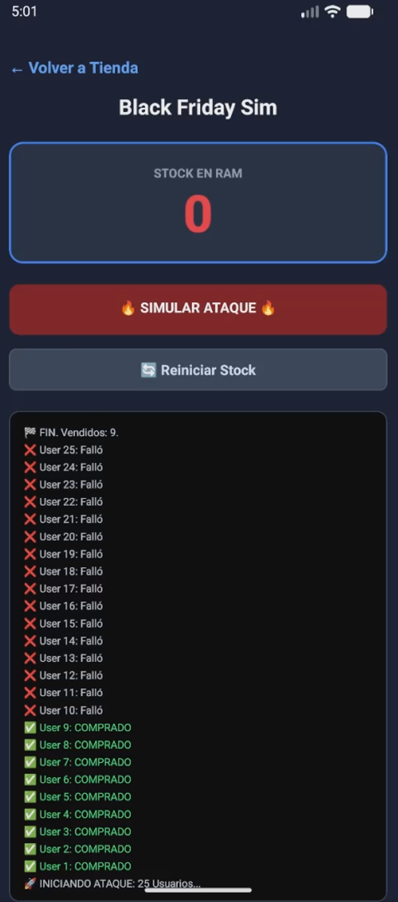
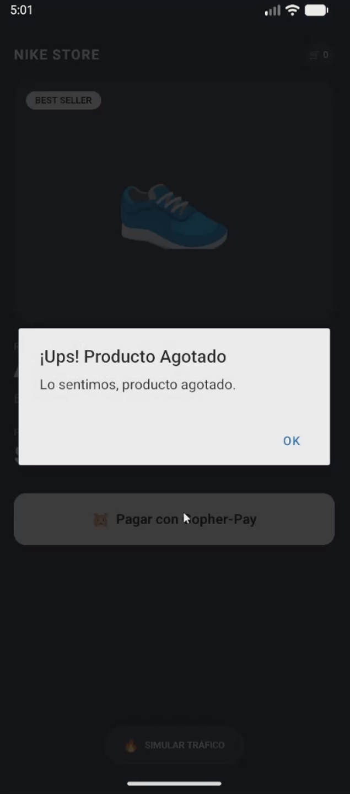

# Gopher-Pay 🐹 | High-Concurrency BNPL Engine

**Gopher-Pay** is a production-ready prototype of a **Buy Now, Pay Later (BNPL)** system. It features a high-performance **Go (Golang)** backend capable of handling high-concurrency scenarios (like "Black Friday" traffic) and a cross-platform **React Native (Expo)** frontend.

This project demonstrates how to solve critical fintech challenges: **race conditions**, **inventory locking**, and **precision integer math**.

---

## 🎥 Live Demo

Watch the full end-to-end workflow, including the **Stress Test** and real-time **Backend Console Logs** showing Mutex locking in action:

[**▶️ Watch Demo Video**](https://drive.google.com/file/d/1WSmcBVbfh4NHn9YgnySkif3KoMRGN7BT/view?usp=sharing)

---

## 📸 Screenshots

| Product Page | Purchase Success |
|:---:|:---:|
|  |  |
| **Clean UI with NativeWind** | **Installment Calculation** |

| Stress Test Dashboard | Simulation Results | Stock Depleted |
|:---:|:---:|:---:|
|  |  |  |
| **Real-time Stock Monitor** | **25 Concurrent Requests** | **Graceful Failure Handling** |

---

## 🚀 Key Features

### 🛡️ Backend: Go & Concurrency Control
The API is built with **Go 1.22+** and **Gin**, designed to be bulletproof under heavy load.

* **Thread-Safe Inventory (Mutex Locks):** Uses `sync.Mutex` to prevent **Race Conditions**. Even if 100 users click "Buy" at the exact same millisecond with only 1 item in stock, the engine processes requests sequentially in memory, ensuring inventory never drops below zero.
* **Integer Math (`int64`):** All monetary values are handled in cents to avoid floating-point errors (IEEE 754), a critical requirement for fintech applications.
* **Split Logic:** Handles payment splits with remainder distribution (e.g., $100.01 → $25.01, $25.00, $25.00, $25.00).

### 📱 Frontend: React Native & Expo
The frontend is a "Write Once, Run Everywhere" application.

* **Native-First Architecture:** Built using strictly `<View>`, `<Text>`, and `<Pressable>` primitives. No HTML tags.
* **NativeWind (TailwindCSS):** Styling is handled via utility classes (`className="bg-gray-900"`), ensuring consistency between Web, iOS, and Android.
* **Stress Simulator:** Includes a developer tool that fires 25 simultaneous asynchronous requests to the backend to visualize the concurrency logic in real-time.

---

## 🛠️ Tech Stack

**Backend**
* **Language:** Go (Golang)
* **Framework:** Gin Gonic
* **Concurrency:** Go Routines & Sync Mutex
* **Architecture:** Hexagonal / Clean Architecture Service Layer

**Frontend**
* **Framework:** React Native (Expo SDK 54)
* **Language:** TypeScript
* **Styling:** NativeWind v4 (TailwindCSS)
* **Networking:** Fetch API
* **Router:** Custom State Navigation (Single-file optimized)

---

## 🏗️ Architecture: The "Black Friday" Problem

In a standard Node.js or Python backend, handling concurrent requests often requires complex database locking or Redis queues to prevent overselling. **Gopher-Pay** solves this at the application level using Go's primitives.

### How it works:

1.  **Request:** 25 users hit `POST /checkout` simultaneously.
2.  **Mutex Lock:** The `BNPLService` locks the critical section (`mu.Lock()`).
3.  **Processing:**
    * Check Stock > 0.
    * Decrement Stock.
    * Calculate Installments.
4.  **Unlock:** The service unlocks (`mu.Unlock()`) for the next request.

**Result:** Zero overselling, guaranteed data integrity.

---

## ⚡ Getting Started

### 1. Backend Setup (Go)

```bash
cd backend

# Initialize modules
go mod tidy

# Run the server (Listens on port 8080)
go run cmd/api/main.go

```

### 2. Frontend Setup (React Native)

```bash
cd frontend

# Install dependencies (Legacy peer deps required for React 19 alpha compatibility)
npm install --legacy-peer-deps

# Start the app
npx expo start -c

```

*Note: Use `w` for Web, `a` for Android Emulator, or scan the QR code with your phone.*

---

## 📡 API Endpoints

| Method | Endpoint | Description |
| --- | --- | --- |
| `GET` | `/api/v1/stock` | Returns current inventory count (RAM). |
| `POST` | `/api/v1/checkout` | Attempts to purchase an item. Body: `{ "total_cents": 14000 }` |
| `POST` | `/api/v1/stock/reset` | Resets the stock counter to 10 for testing. |

---

## 📝 License

This project is open-source and available under the MIT License.

---

*Built by José Luis Vergara as a Proof of Concept for Fintech Engineering.*